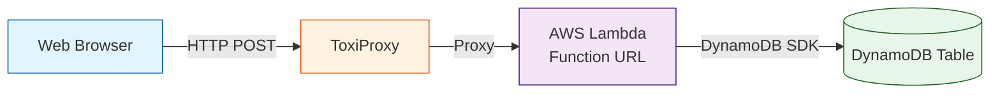

# Chaos Engineering Lab: Building Antifragile Systems

## Overview

This hands-on lab teaches chaos engineering principles through practical experimentation with a real-world web application. You will deploy **Coffee Chaos** - a premium coffee bean e-commerce store - with a serverless backend, intentionally inject failures using ToxiProxy, observe how the system degrades, and then implement resilience patterns to make it antifragile.

Coffee Chaos is a React-based single-page application featuring six specialty coffee varieties from around the world: Ethiopian Yirgacheffe, Colombian Supremo, Guatemalan Antigua, Kenyan AA, Sumatra Mandheling, and Costa Rican Tarrazu. Users can browse products with detailed tasting notes, add items to their cart with smooth Framer Motion animations, adjust quantities, and complete checkout. Orders are posted to an AWS Lambda function URL and stored in DynamoDB.

This lab is divided into three parts:
- **Part 1:** Deploy the system, run chaos experiments, observe failures
- **Part 2:** Implement tactical robustness improvements (choose one: retries, validation, or circuit breaker)
- **Part 3:** Use AI to explore strategic re-architecture for resilience

By the end of this lab, you will understand:
- How distributed systems fail under stress
- The scientific method of chaos engineering
- Practical resilience patterns: retries, timeouts, circuit breakers, validation
- How to use AI assistants effectively for architectural design
- How to build systems that improve from failure

## Getting Started with GitHub Codespaces

This lab is designed to run in GitHub Codespaces, which provides a complete development environment in your browser.

### Launch Your Codespace

1. Fork or clone this repository to your GitHub account
2. Click the green "Code" button
3. Select the "Codespaces" tab
4. Click "Create codespace on main"

GitHub will automatically set up your environment with:
- Terraform pre-installed
- Go toolchain for Lambda development
- Docker for running ToxiProxy
- AWS CLI pre-configured
- All dependencies ready to use

Your Codespace will be ready in 1-2 minutes. No local installation required!

## Architecture



**How it works:**
- Users browse coffee products and add them to their shopping cart
- The React webapp uses Framer Motion for smooth animations
- When users click checkout, orders are posted via HTTP to a Lambda function
- Lambda stores order data in DynamoDB
- **ToxiProxy sits between the webapp and Lambda to inject network failures**

### Configure AWS Credentials

Once your Codespace launches, configure your AWS credentials:

```bash
aws configure
```

Enter your:
- AWS Access Key ID
- AWS Secret Access Key
- Default region: `eu-north-1`
- Default output format: `json`

Alternatively, set environment variables:

```bash
export AWS_ACCESS_KEY_ID=your_access_key
export AWS_SECRET_ACCESS_KEY=your_secret_key
export AWS_DEFAULT_REGION=eu-north-1
```

## Lab Structure

This lab follows the chaos engineering cycle:

1. **Steady State**: Understand how the system works normally
2. **Hypothesis**: Predict how it will fail under stress
3. **Experiment**: Inject real-world failures
4. **Observation**: Measure the impact
5. **Improvement**: Implement resilience patterns
6. **Validation**: Verify the improvements

---

# Part 1: Chaos Engineering Experiments

In Part 1, you will deploy a deliberately fragile system, run chaos experiments, and observe how it fails.

## Step 1: Familiarize with the Code

Explore the repository structure using the VS Code file explorer.

### Explore the Lambda Function

Open `lambda/main.go` in the VS Code editor.

**Key observations:**
- The handler accepts POST requests with JSON payload
- It stores data in DynamoDB with `student_id` as partition key
- Simple error handling with basic logging

### Explore the Web Application

The webapp is a React single-page application built with Vite and Framer Motion. Open these key files in VS Code:

- `webapp/src/App.jsx` - Main application component
- `webapp/src/components/Cart.jsx` - Shopping cart with checkout logic
- `webapp/src/data/products.js` - Six specialty coffee products

**Key observations:**
- React with Vite build tool and Framer Motion animations
- Six premium coffee products with emoji icons, tasting notes, origin, and roast level
- Shopping cart with add/remove functionality and quantity controls
- Makes POST requests to Lambda function URL on checkout
- **No retry logic** - failures show immediately
- Basic error handling displays error messages but doesn't retry failed requests

### Explore the Infrastructure

Open the Terraform files in VS Code:

- `infra/main.tf` - Main infrastructure definition
- `infra/variables.tf` - Input variables
- `infra/outputs.tf` - Output values

**Key observations:**
- Terraform module that requires `student_id` variable
- Creates DynamoDB table with on-demand billing
- Lambda function with Function URL enabled
- IAM role with DynamoDB permissions

## Step 2: Build the Lambda Function

Before deploying with Terraform, you need to build the Lambda deployment package.

From your Codespace terminal:

```bash
cd lambda
make
```

This will:
1. Install Go dependencies with `go mod tidy`
2. Build the Lambda binary for Linux
3. Create `function.zip` for deployment

You should see output confirming the package was created.

## Step 3: Deploy Your Infrastructure

From your Codespace terminal, create a deployment directory:

```bash
cd ..
mkdir -p my-deployment
cd my-deployment
```

Create a `main.tf` file that uses the module:

```hcl
terraform {
  required_providers {
    aws = {
      source  = "hashicorp/aws"
      version = "~> 5.0"
    }
  }
}

provider "aws" {
  region = "eu-north-1"
}

module "coffee_chaos" {
  source = "../infra"

  student_id = "YOUR_NAME_HERE"  # Replace with your name (lowercase, no spaces)
}

output "lambda_function_url" {
  value = module.coffee_chaos.lambda_function_url
  description = "URL to call from webapp"
}

output "dynamodb_table_name" {
  value = module.coffee_chaos.dynamodb_table_name
}
```

Deploy the infrastructure:

```bash
terraform init
terraform plan
terraform apply
```

**Save the outputs** - you'll need the `lambda_function_url` for the webapp.

## Step 4: Test the Application (Without Chaos)

### Configure the Webapp

Open `webapp/src/config.js` in VS Code and update the Lambda function URL with the output from terraform:

```javascript
export const LAMBDA_URL = 'https://your-lambda-url.lambda-url.eu-north-1.on.aws/';  // From terraform output
```

Save the file.

### Open the Webapp in Your Browser

Start the React development server with Vite:

```bash
cd webapp
npm install  # Install dependencies (first time only)
npm run dev
```

VS Code will detect the port and show a notification. Click "Open in Browser" or:
1. Click the "Ports" tab at the bottom of VS Code
2. Find port 5173 (Vite dev server)
3. Click the globe icon to open the webapp in your browser

The webapp should now be accessible at a URL like: `https://[codespace-name]-5173.preview.app.github.dev`

### Test Normal Operation

1. Browse the six specialty coffee products
2. Add items to your cart (observe the smooth animations)
3. Adjust quantities using the + and - buttons
4. Click the "Checkout" button

**What should happen:**
- The order is sent to Lambda via HTTP POST
- Lambda stores the order in DynamoDB
- You'll see a success message
- The cart clears automatically

If you see errors, check:
- Lambda URL is configured correctly in `Cart.jsx`
- AWS credentials are valid
- DynamoDB table was created successfully

**Document your observation:**
- How fast is the checkout process?
- What feedback does the UI provide?
- How responsive does the application feel?

## Step 5: Hypothesize About Network Failures

Before injecting chaos, make predictions using the scientific method.

**Write down your hypothesis:**

1. **What will happen when we add 2000ms latency?**
   - How will the UI respond?
   - Will users click checkout multiple times?
   - What will happen to DynamoDB (duplicate records)?

2. **What will happen when we add 50% packet loss?**
   - How many requests will fail?
   - Will the UI show errors?
   - What will users think is broken?

3. **What will happen when we add random timeouts?**
   - Will some requests succeed?
   - How will users know if their order worked?

**Save your hypotheses** - you'll compare them to actual results.

## Step 6: Configure ToxiProxy

ToxiProxy is a proxy that lets you inject network failures between your webapp and Lambda.

### Start ToxiProxy

From your Codespace terminal:

```bash
cd webapp
docker-compose up -d
```

This starts:
- ToxiProxy server on port 8474 (control API)
- Proxy listening on port 8000 (forwards to Lambda)

Note: Docker is pre-installed in your Codespace. You may need to wait a few seconds for the Docker daemon to start if you just created the Codespace.

### Configure the Proxy

Update `webapp/src/config.js` to use ToxiProxy instead of direct Lambda URL:

```javascript
export const LAMBDA_URL = 'http://localhost:8000';  // Through ToxiProxy
```

### Add Latency Toxic

Use ToxiProxy CLI or HTTP API to add latency:

```bash
# Add 2000ms latency
docker exec -it toxiproxy /bin/sh -c "toxiproxy-cli toxic add chaos-proxy -t latency -a latency=2000"
```

Or use curl:

```bash
curl -X POST http://localhost:8474/proxies/chaos-proxy/toxics \
  -H 'Content-Type: application/json' \
  -d '{"name": "latency", "type": "latency", "attributes": {"latency": 2000}}'
```

### Available Toxics

ToxiProxy supports many failure modes:

**Latency:** Add delay to requests
```bash
{"type": "latency", "attributes": {"latency": 2000, "jitter": 500}}
```

**Bandwidth:** Limit throughput
```bash
{"type": "bandwidth", "attributes": {"rate": 1024}}
```

**Timeout:** Close connection after delay
```bash
{"type": "timeout", "attributes": {"timeout": 1000}}
```

**Slicer:** Slice data into small packets
```bash
{"type": "slicer", "attributes": {"average_size": 64, "size_variation": 32, "delay": 10}}
```

## Step 7: Run Experiments and Observe

### Experiment 1: High Latency

**Setup:** 2000ms latency, 500ms jitter

```bash
curl -X POST http://localhost:8474/proxies/chaos-proxy/toxics \
  -H 'Content-Type: application/json' \
  -d '{"name": "high-latency", "type": "latency", "attributes": {"latency": 2000, "jitter": 500}}'
```

**Test:**
1. Add coffee to your cart and click "Checkout"
2. Observe the delay in order processing
3. Try clicking checkout multiple times before first response returns
4. Check DynamoDB for duplicate orders

**Measure:**
- How long does each checkout request take?
- Do users get frustrated and click checkout again?
- Are there duplicate orders in the database?
- Does the UI give any feedback during the wait?

### Experiment 2: Random Failures

**Setup:** 5000ms timeout

```bash
curl -X POST http://localhost:8474/proxies/chaos-proxy/toxics \
  -H 'Content-Type: application/json' \
  -d '{"name": "timeout", "type": "timeout", "attributes": {"timeout": 5000}}'
```

**Test:**
1. Click checkout multiple times
2. Some requests will timeout
3. Others will succeed

**Measure:**
- What is the failure rate?
- How does the UI show failures?
- Can users tell if their order worked?

### Experiment 3: Limited Bandwidth

**Setup:** 1KB/s bandwidth limit

```bash
curl -X POST http://localhost:8474/proxies/chaos-proxy/toxics \
  -H 'Content-Type: application/json' \
  -d '{"name": "slow-bandwidth", "type": "bandwidth", "attributes": {"rate": 1024}}'
```

**Test:**
1. Make requests and observe slow responses
2. Multiple concurrent requests

**Measure:**
- How does slow bandwidth affect user experience?
- Do requests queue up?

### Reset Between Experiments

Remove all toxics to reset:

```bash
curl -X DELETE http://localhost:8474/proxies/chaos-proxy/toxics/high-latency
```

## Step 8: Reflect and Document Your Findings

Compare your hypothesis to actual observations:

**Analysis Questions:**

1. **What was the worst user experience?**
   - Long waits with no feedback?
   - Silent failures?
   - Duplicate actions?

2. **What resilience patterns would help?**
   - Retries for transient failures?
   - Timeouts to fail fast?
   - Optimistic UI updates?
   - Circuit breaker to prevent cascading failures?
   - Loading indicators and progress feedback?

3. **What should the steady state be?**
   - Response time < 500ms for 99% of requests?
   - No duplicate records?
   - Clear error messages?
   - Graceful degradation under load?

**Document your findings:**

Create a brief report with:
- Hypothesis for each experiment
- Actual observed behavior
- Screenshots or logs showing failures
- List of proposed improvements

Save your findings - you'll implement improvements in Part 2.

---

# Part 2: Robustness Improvements

Now that you've experienced the chaos of distributed systems firsthand, it's time to make your application more robust. In this part, you'll implement improvements to handle network failures, timeouts, and other issues gracefully.

## Task Overview

Choose **ONE** of the three robustness improvements below to implement. After implementing your chosen improvement:

1. **Deploy** your changes (both Lambda and/or webapp as needed)
2. **Test** using your ToxiProxy setup from Part 1
3. **Observe** how your improvement affects the application behavior
4. **Document** your findings (what worked, what didn't, what you learned)

> **Important**: Implement one improvement at a time. Deploy, test, and observe before moving to the next one.

## Option 1: Frontend Retry Logic with Exponential Backoff

### Problem
When the Lambda function is slow or temporarily unavailable, the frontend gives up after a single failed request. Users see an error immediately, even though the backend might recover in a few seconds.

### Current Behavior
In `webapp/src/components/Cart.jsx:32-44`, a single fetch request is made with no retry logic.

### Your Task
Implement a retry mechanism with exponential backoff in the Cart component:

1. **Add retry logic**: If the request fails, retry up to 3 times
2. **Exponential backoff**: Wait 1s, then 2s, then 4s between retries
3. **User feedback**: Update the status message to show retry attempts
4. **Timeout handling**: Add a timeout to each fetch request (e.g., 10 seconds)

### Hints
- Create a `retryFetch()` helper function that wraps the fetch call
- Use `setTimeout()` or `async/await` with delays for backoff
- Consider using `AbortController` for request timeouts
- Update UI to show "Retrying (attempt 2/3)..." messages

### Testing with ToxiProxy
```bash
# Simulate temporary outage (recovers after 5 seconds)
curl -X POST http://localhost:8474/proxies/chaos-proxy/toxics \
  -d '{"name": "latency_spike", "type": "latency", "attributes": {"latency": 3000}}'

# Try checkout - your retry logic should succeed after 1-2 retries

# Remove toxic
curl -X DELETE http://localhost:8474/proxies/chaos-proxy/toxics/latency_spike
```

### Success Criteria
- Application successfully completes checkout even with temporary network issues
- User sees clear feedback about retry attempts
- No duplicate orders are created

## Option 2: Lambda Request Validation and Error Handling

### Problem
The Lambda function doesn't validate incoming requests thoroughly. Invalid data can cause crashes or be stored in DynamoDB. There's also no idempotency protection against duplicate requests.

### Current Behavior
In `lambda/main.go:68-79`, minimal validation is performed - only checks if JSON is parsable.

### Your Task
Add comprehensive validation and error handling to the Lambda function:

1. **Request validation**:
   - Verify `order.Items` is not empty
   - Validate that item prices are positive numbers
   - Validate that quantities are positive integers
   - Check that `order.Total` matches the sum of items
   - Ensure `order.Timestamp` is a valid ISO8601 date

2. **Idempotency**:
   - Accept an optional `idempotency_key` in the request
   - Before processing, check if an order with this key already exists
   - Return the existing order if found (preventing duplicates)
   - Store the idempotency key in DynamoDB

3. **Error responses**:
   - Return specific HTTP status codes (400 for validation, 409 for duplicates, 500 for server errors)
   - Include detailed error messages that help debug issues

### Hints
- Create a `validateOrder()` function that returns specific validation errors
- Add `IdempotencyKey` field to the `Order` and `OrderRecord` structs
- Use DynamoDB's `ConditionExpression` to prevent duplicate keys
- Consider adding GSI on `IdempotencyKey` for efficient lookups

### Testing
```bash
# Test with duplicate submissions
# In your browser console:
const order = {
  items: [{id: "1", name: "Coffee", price: 15.99, quantity: 1}],
  total: 15.99,
  timestamp: new Date().toISOString(),
  idempotency_key: "test-123"
}

// Send twice - should get same order ID both times
await fetch(LAMBDA_URL, {
  method: 'POST',
  headers: {'Content-Type': 'application/json'},
  body: JSON.stringify(order)
})
```

### Success Criteria
- Invalid orders are rejected with clear error messages
- Duplicate submissions return the same order ID without creating duplicates
- All validation errors include helpful messages for debugging

## Option 3: Circuit Breaker Pattern in Frontend

### Problem
When the Lambda function is completely down, the frontend keeps trying to send requests, leading to poor user experience. Each checkout attempt takes the full timeout period before failing.

### Current Behavior
Every checkout attempt makes a request to the Lambda, regardless of previous failures. If the backend is down, users experience repeated long waits.

### Your Task
Implement the Circuit Breaker pattern in the frontend:

1. **Circuit states**:
   - **Closed**: Normal operation, requests go through
   - **Open**: Too many failures detected, fail fast without making requests
   - **Half-Open**: After timeout, try one request to test if backend recovered

2. **Failure threshold**: Open circuit after 3 consecutive failures

3. **Recovery timeout**: After 30 seconds in Open state, transition to Half-Open

4. **User feedback**:
   - Show when circuit is open ("Service temporarily unavailable, will retry in 25s")
   - Show countdown timer
   - Allow manual "Try Again" button

### Hints
- Create a `CircuitBreaker` class or React hook (e.g., `useCircuitBreaker()`)
- Track failure count and circuit state in React state or localStorage
- Use `setTimeout()` to handle recovery timeout
- Consider showing a different UI when circuit is open

### Testing with ToxiProxy
```bash
# Simulate complete backend failure
curl -X POST http://localhost:8474/proxies/chaos-proxy/toxics \
  -d '{"name": "timeout", "type": "timeout", "attributes": {"timeout": 0}}'

# Try checkout 3 times - circuit should open
# Wait for recovery period - circuit should allow one test request

# Remove toxic
curl -X DELETE http://localhost:8474/proxies/chaos-proxy/toxics/timeout

# Circuit should close and requests succeed
```

### Success Criteria
- Circuit opens after repeated failures
- Users get immediate feedback when circuit is open
- Circuit recovers automatically when backend comes back
- No wasted requests when backend is known to be down

## Deployment Workflow

### For Lambda changes (Option 2):
```bash
cd lambda
make
cd ../my-deployment
terraform apply
```

### For Frontend changes (Options 1 & 3):
Restart your dev server to see changes, or build for production deployment.

## Document Your Findings

Create a file `ROBUSTNESS-FINDINGS.md` with:

```markdown
# Robustness Improvement Findings

## Improvement Implemented
[Option 1, 2, or 3]

## Changes Made
- Files changed: ...
- Key code changes: ...

## Testing Performed
- Toxic used: ...
- Expected behavior: ...
- Actual behavior: ...

## Observations
- What worked well: ...
- Unexpected discoveries: ...

## Metrics
- Before: [e.g., 100% failure rate with 3s latency]
- After: [e.g., 95% success rate after retries]

## Lessons Learned
[Your insights about building robust distributed systems]
```

---

# Part 3: AI-Assisted Re-Architecture

In Parts 1 and 2, you worked with chaos engineering and tactical robustness improvements. Now you'll explore how AI can help you think bigger: **re-architecting the entire solution** for robustness, scalability, and maintainability.

This part focuses on **working effectively with AI coding assistants** like Claude Code to explore architectural alternatives, evaluate trade-offs, and implement more sophisticated solutions.

## Learning Objectives

- Learn how to prompt AI assistants for architectural guidance
- Compare minimal context vs. detailed context prompting strategies
- Use plan mode to explore solutions before implementation
- Critically evaluate AI-generated architectural proposals
- Document the AI collaboration process

## Overview of Experiments

You'll perform **three experiments** with Claude Code, each using a different prompting strategy:

1. **Minimal Context Experiment**: Give vague requirements ("make it robust")
2. **Detailed Context Experiment**: Provide specific architectural goals
3. **Plan Mode Experiment**: Use Claude Code's plan mode for collaborative design

After each experiment, you'll **take notes** on the AI's suggestions, your assessment of them, and what you learned.

## Experiment 1: Minimal Context

### The Prompt

Start a conversation with Claude Code and say:

```
Make my application more robust.
```

That's it. Don't provide additional context unless Claude asks.

### What to Observe

- What questions does Claude ask?
- What assumptions does Claude make?
- What solutions does Claude propose?
- How specific or generic are the suggestions?
- Does Claude explore the codebase before suggesting changes?

### Take Notes

Create a file `AI-EXPERIMENT-1-MINIMAL.md` documenting:
- Claude's questions and assumptions
- Solutions proposed
- Your assessment (strengths, weaknesses, surprises)
- What you learned about prompting AI

## Experiment 2: Detailed Context

### The Prompt

Start a **new conversation** with detailed requirements:

```
I want to re-architect my coffee shop application for better robustness and decoupling.

Current architecture:
- React frontend with client-side cart state
- Direct synchronous calls to AWS Lambda Function URL
- Lambda writes to DynamoDB immediately
- No CORS headers (intentionally broken for learning)

Problems I want to solve:
1. Frontend is tightly coupled to Lambda - failures affect user experience immediately
2. No way to retry failed orders
3. Orders are lost if Lambda fails after accepting the request
4. No visibility into order status
5. Difficult to test and debug distributed failures

Goals for re-architecture:
- Decouple frontend from backend processing
- Make order submission asynchronous and reliable
- Add order status tracking
- Implement proper error recovery
- Maintain simplicity (this is a learning project, not production)

Technologies I'm already using:
- AWS Lambda, DynamoDB, S3, CloudFront
- React frontend
- Terraform for IaC

Please suggest an architecture that achieves these goals. Explain the trade-offs and what components I'd need to add.
```

### What to Observe

- How does Claude's response differ from Experiment 1?
- Does Claude suggest specific AWS services or patterns?
- Does Claude explain trade-offs?
- Are the suggestions practical given your constraints?

### Take Notes

Create `AI-EXPERIMENT-2-DETAILED.md` documenting:
- Architecture proposed
- Components to add and their trade-offs
- Technologies suggested
- Comparison to Experiment 1
- What you learned

## Experiment 3: Plan Mode Collaboration

### The Workflow

1. Start a **new conversation** and enter **plan mode**
2. Ask Claude to explore multiple architectural options
3. Iterate on the proposals through back-and-forth discussion
4. Refine until you have a clear plan

### Example Iteration

```
I want to improve the robustness of my coffee shop application. Before we write any code, let's create a plan.

Current situation:
- Frontend makes direct synchronous calls to Lambda
- Lambda writes to DynamoDB immediately
- No retry logic or error recovery

I want to explore architectural options that:
- Reduce coupling between frontend and backend
- Allow the system to handle temporary failures gracefully
- Don't require major rewrites (incremental improvements are OK)

Let's discuss a few approaches and their trade-offs before deciding on one.
```

Then iterate with questions like:
- "What if we wanted to keep the synchronous API but add retry logic?"
- "How does the SQS approach compare to using Step Functions?"
- "What's the minimal viable improvement we could ship this week?"

### Take Notes

Create `AI-EXPERIMENT-3-PLAN-MODE.md` documenting:
- The iteration log (questions asked, responses)
- Final plan agreed upon
- How plan mode changed the collaboration
- Quality assessment of the final plan

## Optional: Implement the Plan

If time permits, implement one of the proposed architectures and document what worked vs. what needed adjustment in `AI-EXPERIMENT-3-IMPLEMENTATION.md`.

## Reflection

After completing all experiments, create `AI-EXPERIMENTS-REFLECTION.md`:

```markdown
# Overall Reflection on AI-Assisted Architecture

## Key Learnings
1. [Most important lesson]
2. [Second lesson]
3. [Third lesson]

## Best Practices Discovered
- Prompting strategies that work
- How to iterate effectively
- When to trust vs question AI

## The Human's Role
- What can AI not do (yet)?
- Where was your expertise critical?
- What decisions should always be human-made?
```

## Discussion Questions

Prepare to discuss:

1. Which prompting strategy worked best?
2. Did AI suggest anything you wouldn't have thought of?
3. When would you use AI for architecture decisions in real work?
4. What are the risks of following AI architectural suggestions?
5. How do you validate AI-generated designs?

---

## Cleanup

When you're done with the lab, clean up your resources:

### Destroy AWS Infrastructure

From the terminal in your Codespace:

```bash
cd my-deployment
terraform destroy
```

### Stop ToxiProxy

```bash
cd ../webapp
docker-compose down
```

### Delete Your Codespace

1. Go to https://github.com/codespaces
2. Find your Codespace for this repository
3. Click the three dots menu
4. Select "Delete"

This ensures you don't accumulate storage charges for the Codespace.

## Conclusion

You've completed a full chaos engineering cycle:

1. Built a distributed system
2. Established steady state behavior
3. Hypothesized about failure modes
4. Injected real-world failures
5. Observed degradation
6. Implemented resilience patterns
7. Validated improvements

**Key Learnings:**

- Distributed systems fail in complex ways
- Latency is a common failure mode that cascades
- User experience degrades without proper error handling
- Resilience patterns (retries, timeouts, circuit breakers) are essential
- Chaos engineering helps you find weaknesses before users do
- Antifragile systems improve from stress and failure

## Additional Challenges

1. **Add CloudWatch Alarms** - Alert when Lambda errors exceed threshold
2. **Implement Request Deduplication** - Use idempotency keys
3. **Add Caching** - Store orders locally, sync periodically
4. **Multi-Region** - Deploy to two regions for higher availability
5. **Chaos in Production** - Gradually roll out chaos to real users (with safeguards!)

## References

- [Principles of Chaos Engineering](https://principlesofchaos.org/)
- [ToxiProxy Documentation](https://github.com/Shopify/toxiproxy)
- [AWS Lambda Function URLs](https://docs.aws.amazon.com/lambda/latest/dg/lambda-urls.html)
- [DynamoDB Best Practices](https://docs.aws.amazon.com/amazondynamodb/latest/developerguide/best-practices.html)
