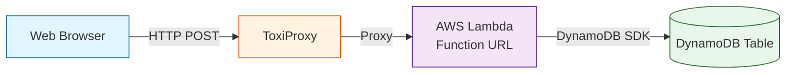

# Chaos Engineering Lab: Building Antifragile Systems

## Overview

This hands-on lab teaches chaos engineering principles through practical experimentation with a real-world web application. You will deploy **Coffee Chaos** - a premium coffee bean e-commerce store - with a serverless backend, intentionally inject failures using ToxiProxy, observe how the system degrades, and then implement resilience patterns to make it antifragile.

Coffee Chaos is a React-based single-page application featuring six specialty coffee varieties from around the world: Ethiopian Yirgacheffe, Colombian Supremo, Guatemalan Antigua, Kenyan AA, Sumatra Mandheling, and Costa Rican Tarrazu. Users can browse products with detailed tasting notes, add items to their cart with smooth Framer Motion animations, adjust quantities, and complete checkout. Orders are posted to an AWS Lambda function URL and stored in DynamoDB.

This lab is divided into two parts:
- **Part 1:** Deploy the system, run chaos experiments, observe failures
- **Part 2:** Implement resilience patterns to make the system antifragile

By the end of this lab, you will understand:
- How distributed systems fail under stress
- The scientific method of chaos engineering
- Practical resilience patterns: retries, timeouts, circuit breakers
- How to build systems that improve from failure

## Getting Started with GitHub Codespaces

This lab is designed to run in GitHub Codespaces, which provides a complete development environment in your browser.

### Launch Your Codespace

1. Fork or clone this repository to your GitHub account
2. Click the green "Code" button
3. Select the "Codespaces" tab
4. Click "Create codespace on main"

GitHub will automatically set up your environment with:
- Terraform pre-installed
- Go toolchain for Lambda development
- Docker for running ToxiProxy
- AWS CLI pre-configured
- All dependencies ready to use

Your Codespace will be ready in 1-2 minutes. No local installation required!

## Architecture



**How it works:**
- Users browse coffee products and add them to their shopping cart
- The React webapp uses Framer Motion for smooth animations
- When users click checkout, orders are posted via HTTP to a Lambda function
- Lambda stores order data in DynamoDB
- **ToxiProxy sits between the webapp and Lambda to inject network failures**

### Configure AWS Credentials

Once your Codespace launches, configure your AWS credentials:

```bash
aws configure
```

Enter your:
- AWS Access Key ID
- AWS Secret Access Key
- Default region: `us-east-1`
- Default output format: `json`

Alternatively, set environment variables:

```bash
export AWS_ACCESS_KEY_ID=your_access_key
export AWS_SECRET_ACCESS_KEY=your_secret_key
export AWS_DEFAULT_REGION=us-east-1
```

## Lab Structure

This lab follows the chaos engineering cycle:

1. **Steady State**: Understand how the system works normally
2. **Hypothesis**: Predict how it will fail under stress
3. **Experiment**: Inject real-world failures
4. **Observation**: Measure the impact
5. **Improvement**: Implement resilience patterns
6. **Validation**: Verify the improvements

---

# Part 1: Chaos Engineering Experiments

In Part 1, you will deploy a deliberately fragile system, run chaos experiments, and observe how it fails.

## Step 1: Familiarize with the Code

The repository is cloned in `/workspaces/[repo-name]` in your Codespace. You can navigate using the VS Code file explorer or the terminal.

### Explore the Lambda Function

Open `lambda/main.go` in the VS Code editor, or view it in the terminal:

```bash
cat lambda/main.go
```

**Key observations:**
- The handler accepts POST requests with JSON payload
- It stores data in DynamoDB with `student_id` as partition key
- Simple error handling with basic logging

### Explore the Web Application

The webapp is a React single-page application built with Vite and Framer Motion. View the key files:

```bash
cat webapp/src/App.jsx
cat webapp/src/components/Cart.jsx
cat webapp/src/data/products.js
```

**Key observations:**
- React with Vite build tool and Framer Motion animations
- Six premium coffee products with emoji icons, tasting notes, origin, and roast level
- Shopping cart with add/remove functionality and quantity controls
- Makes POST requests to Lambda function URL on checkout
- **No retry logic** - failures show immediately
- Basic error handling displays error messages but doesn't retry failed requests

### Explore the Infrastructure

Open the Terraform files in VS Code or view them in the terminal:

```bash
cat infra/main.tf
cat infra/variables.tf
cat infra/outputs.tf
```

**Key observations:**
- Terraform module that requires `student_id` variable
- Creates DynamoDB table with on-demand billing
- Lambda function with Function URL enabled
- IAM role with DynamoDB permissions

## Step 2: Deploy Your Infrastructure

From your Codespace terminal, create a deployment directory:

```bash
mkdir -p my-deployment
cd my-deployment
```

Create a `main.tf` file that uses the module:

```hcl
terraform {
  required_providers {
    aws = {
      source  = "hashicorp/aws"
      version = "~> 5.0"
    }
  }
}

provider "aws" {
  region = "us-east-1"
}

module "coffee_chaos" {
  source = "../infra"

  student_id = "YOUR_NAME_HERE"  # Replace with your name (lowercase, no spaces)
}

output "lambda_function_url" {
  value = module.coffee_chaos.lambda_function_url
  description = "URL to call from webapp"
}

output "dynamodb_table_name" {
  value = module.coffee_chaos.dynamodb_table_name
}
```

Deploy the infrastructure:

```bash
terraform init
terraform plan
terraform apply
```

**Save the outputs** - you'll need the `lambda_function_url` for the webapp.

## Step 3: Test the Application (Without Chaos)

### Configure the Webapp

Open `webapp/src/components/Cart.jsx` in VS Code and update the Lambda function URL with the output from terraform:

```javascript
const LAMBDA_URL = 'YOUR_FUNCTION_URL_HERE';  // From terraform output
```

Save the file.

### Open the Webapp in Your Browser

Start the React development server with Vite:

```bash
cd webapp
npm install  # Install dependencies (first time only)
npm run dev
```

VS Code will detect the port and show a notification. Click "Open in Browser" or:
1. Click the "Ports" tab at the bottom of VS Code
2. Find port 5173 (Vite dev server)
3. Click the globe icon to open the webapp in your browser

The webapp should now be accessible at a URL like: `https://[codespace-name]-5173.preview.app.github.dev`

### Test Normal Operation

1. Browse the six specialty coffee products
2. Add items to your cart (observe the smooth animations)
3. Adjust quantities using the + and - buttons
4. Click the "Checkout" button

**What should happen:**
- The order is sent to Lambda via HTTP POST
- Lambda stores the order in DynamoDB
- You'll see a success message
- The cart clears automatically

If you see errors, check:
- Lambda URL is configured correctly in `Cart.jsx`
- AWS credentials are valid
- DynamoDB table was created successfully

**Document your observation:**
- How fast is the checkout process?
- What feedback does the UI provide?
- How responsive does the application feel?

## Step 4: Hypothesize About Network Failures

Before injecting chaos, make predictions using the scientific method.

**Write down your hypothesis:**

1. **What will happen when we add 2000ms latency?**
   - How will the UI respond?
   - Will users click checkout multiple times?
   - What will happen to DynamoDB (duplicate records)?

2. **What will happen when we add 50% packet loss?**
   - How many requests will fail?
   - Will the UI show errors?
   - What will users think is broken?

3. **What will happen when we add random timeouts?**
   - Will some requests succeed?
   - How will users know if their order worked?

**Save your hypotheses** - you'll compare them to actual results.

## Step 5: Configure ToxiProxy

ToxiProxy is a proxy that lets you inject network failures between your webapp and Lambda.

### Start ToxiProxy

From your Codespace terminal:

```bash
cd webapp
docker-compose up -d
```

This starts:
- ToxiProxy server on port 8474 (control API)
- Proxy listening on port 8000 (forwards to Lambda)

Note: Docker is pre-installed in your Codespace. You may need to wait a few seconds for the Docker daemon to start if you just created the Codespace.

### Configure the Proxy

Update `webapp/src/components/Cart.jsx` to use ToxiProxy instead of direct Lambda URL:

```javascript
const LAMBDA_URL = 'http://localhost:8000';  // Through ToxiProxy
```

### Add Latency Toxic

Use ToxiProxy CLI or HTTP API to add latency:

```bash
# Add 2000ms latency
docker exec -it toxiproxy /bin/sh -c "toxiproxy-cli toxic add chaos-proxy -t latency -a latency=2000"
```

Or use curl:

```bash
curl -X POST http://localhost:8474/proxies/chaos-proxy/toxics \
  -H 'Content-Type: application/json' \
  -d '{"name": "latency", "type": "latency", "attributes": {"latency": 2000}}'
```

### Available Toxics

ToxiProxy supports many failure modes:

**Latency:** Add delay to requests
```bash
{"type": "latency", "attributes": {"latency": 2000, "jitter": 500}}
```

**Bandwidth:** Limit throughput
```bash
{"type": "bandwidth", "attributes": {"rate": 1024}}
```

**Timeout:** Close connection after delay
```bash
{"type": "timeout", "attributes": {"timeout": 1000}}
```

**Slicer:** Slice data into small packets
```bash
{"type": "slicer", "attributes": {"average_size": 64, "size_variation": 32, "delay": 10}}
```

## Step 6: Run Experiments and Observe

### Experiment 1: High Latency

**Setup:** 2000ms latency, 500ms jitter

```bash
curl -X POST http://localhost:8474/proxies/chaos-proxy/toxics \
  -H 'Content-Type: application/json' \
  -d '{"name": "high-latency", "type": "latency", "attributes": {"latency": 2000, "jitter": 500}}'
```

**Test:**
1. Add coffee to your cart and click "Checkout"
2. Observe the delay in order processing
3. Try clicking checkout multiple times before first response returns
4. Check DynamoDB for duplicate orders

**Measure:**
- How long does each checkout request take?
- Do users get frustrated and click checkout again?
- Are there duplicate orders in the database?
- Does the UI give any feedback during the wait?

### Experiment 2: Random Failures

**Setup:** 5000ms timeout

```bash
curl -X POST http://localhost:8474/proxies/chaos-proxy/toxics \
  -H 'Content-Type: application/json' \
  -d '{"name": "timeout", "type": "timeout", "attributes": {"timeout": 5000}}'
```

**Test:**
1. Click checkout multiple times
2. Some requests will timeout
3. Others will succeed

**Measure:**
- What is the failure rate?
- How does the UI show failures?
- Can users tell if their order worked?

### Experiment 3: Limited Bandwidth

**Setup:** 1KB/s bandwidth limit

```bash
curl -X POST http://localhost:8474/proxies/chaos-proxy/toxics \
  -H 'Content-Type: application/json' \
  -d '{"name": "slow-bandwidth", "type": "bandwidth", "attributes": {"rate": 1024}}'
```

**Test:**
1. Make requests and observe slow responses
2. Multiple concurrent requests

**Measure:**
- How does slow bandwidth affect user experience?
- Do requests queue up?

### Reset Between Experiments

Remove all toxics to reset:

```bash
curl -X DELETE http://localhost:8474/proxies/chaos-proxy/toxics/high-latency
```

## Step 7: Reflect and Document Your Findings

Compare your hypothesis to actual observations:

**Analysis Questions:**

1. **What was the worst user experience?**
   - Long waits with no feedback?
   - Silent failures?
   - Duplicate actions?

2. **What resilience patterns would help?**
   - Retries for transient failures?
   - Timeouts to fail fast?
   - Optimistic UI updates?
   - Circuit breaker to prevent cascading failures?
   - Loading indicators and progress feedback?

3. **What should the steady state be?**
   - Response time < 500ms for 99% of requests?
   - No duplicate records?
   - Clear error messages?
   - Graceful degradation under load?

**Document your findings:**

Create a brief report with:
- Hypothesis for each experiment
- Actual observed behavior
- Screenshots or logs showing failures
- List of proposed improvements

Save your findings - you'll implement improvements in Part 2.

---

# Part 2: Implementing Resilience

Part 2 instructions will be provided separately. In Part 2, you will:

1. Implement request timeouts
2. Add retry logic with exponential backoff
3. Implement a circuit breaker pattern
4. Add loading states and error messages
5. Prevent duplicate submissions with debouncing
6. Validate improvements under chaos

For reference implementations, see `solutions/webapp-resilient/`

---

## Cleanup

When you're done with the lab, clean up your resources:

### Destroy AWS Infrastructure

From the terminal in your Codespace:

```bash
cd my-deployment
terraform destroy
```

### Stop ToxiProxy

```bash
cd ../webapp
docker-compose down
```

### Delete Your Codespace

1. Go to https://github.com/codespaces
2. Find your Codespace for this repository
3. Click the three dots menu
4. Select "Delete"

This ensures you don't accumulate storage charges for the Codespace.

## Conclusion

You've completed a full chaos engineering cycle:

1. Built a distributed system
2. Established steady state behavior
3. Hypothesized about failure modes
4. Injected real-world failures
5. Observed degradation
6. Implemented resilience patterns
7. Validated improvements

**Key Learnings:**

- Distributed systems fail in complex ways
- Latency is a common failure mode that cascades
- User experience degrades without proper error handling
- Resilience patterns (retries, timeouts, circuit breakers) are essential
- Chaos engineering helps you find weaknesses before users do
- Antifragile systems improve from stress and failure

## Additional Challenges

1. **Add CloudWatch Alarms** - Alert when Lambda errors exceed threshold
2. **Implement Request Deduplication** - Use idempotency keys
3. **Add Caching** - Store orders locally, sync periodically
4. **Multi-Region** - Deploy to two regions for higher availability
5. **Chaos in Production** - Gradually roll out chaos to real users (with safeguards!)

## References

- [Principles of Chaos Engineering](https://principlesofchaos.org/)
- [ToxiProxy Documentation](https://github.com/Shopify/toxiproxy)
- [AWS Lambda Function URLs](https://docs.aws.amazon.com/lambda/latest/dg/lambda-urls.html)
- [DynamoDB Best Practices](https://docs.aws.amazon.com/amazondynamodb/latest/developerguide/best-practices.html)
