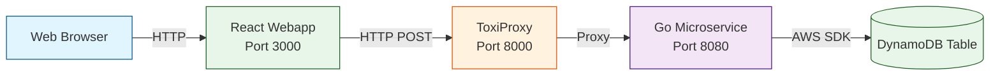

# Chaos Engineering Lab: Building Antifragile Systems

## Overview

This hands-on lab teaches chaos engineering principles through practical experimentation with a real-world web application. You will deploy **Coffee Chaos** - a premium coffee bean e-commerce store - with a containerized microservice backend, intentionally inject failures using ToxiProxy, observe how the system degrades, and then implement resilience patterns to make it antifragile.

Coffee Chaos is a React-based single-page application featuring six specialty coffee varieties from around the world. Users can browse products with detailed tasting notes, add items to their cart, adjust quantities, and complete checkout. Orders are posted to a Go microservice and stored in DynamoDB. The entire application runs locally in Docker containers, making it easy to experiment with network failures in a controlled environment.

This lab is divided into three parts:
- **Part 1:** Deploy the system, run chaos experiments, observe failures
- **Part 2:** Implement tactical robustness improvements (choose one: retries, validation, or circuit breaker)
- **Part 3:** Use AI to explore strategic re-architecture for resilience

By the end of this lab, you will understand:
- How distributed systems fail under stress
- The scientific method of chaos engineering
- Practical resilience patterns: retries, timeouts, circuit breakers, validation
- How to use AI assistants effectively for architectural design
- How to build systems that improve from failure

## Getting Started with GitHub Codespaces

This lab is designed to run in GitHub Codespaces, which provides a complete development environment in your browser.

### Launch Your Codespace

1. Fork or clone this repository to your GitHub account
2. Click the green "Code" button
3. Select the "Codespaces" tab
4. Click "Create codespace on main"

GitHub will automatically set up your environment with:
- Terraform pre-installed
- Go toolchain for microservice development
- Docker for running ToxiProxy
- AWS CLI pre-configured
- All dependencies ready to use

Your Codespace will be ready in 1-2 minutes. No local installation required!


## Architecture



**How it works:**
- Users browse coffee products and add them to their shopping cart in the React webapp (port 3000)
- When users click checkout, orders are posted via HTTP to a Go microservice
- **ToxiProxy sits between the webapp and microservice to inject network failures** (port 8000)
- The Go microservice processes orders and stores them in DynamoDB (port 8080)
- All services run in Docker containers orchestrated by Docker Compose

### About ToxiProxy

ToxiProxy was created by Shopify to simulate network conditions and test application resilience in distributed systems. It acts as a transparent TCP proxy that can inject various network failures (latency, timeouts, bandwidth limits) on demand through a simple HTTP API. Originally built for Shopify's microservices infrastructure, it's now widely used across the industry to test how applications behave under adverse network conditions. Learn more at the [ToxiProxy GitHub repository](https://github.com/Shopify/toxiproxy).

### Docker Compose Setup

The application uses three interconnected Docker containers that start with a single command:

1. **webapp** (React + Vite on port 3000)
   - Serves the frontend application with hot-reload enabled
   - Configured to send requests to ToxiProxy on port 8000

2. **toxiproxy** (ports 8000 and 8474)
   - Acts as a transparent proxy between webapp and Go service
   - Port 8000: Proxy endpoint (webapp → toxiproxy → go-service)
   - Port 8474: Control API for injecting network failures

3. **go-service** (port 8080)
   - HTTP server that processes order requests
   - Connects to AWS DynamoDB using SDK
   - Requires AWS credentials via environment variables

All containers communicate through a Docker bridge network (`chaos-network`).

### Configure Environment Variables

Before starting the services, you need to set up environment variables.

**Create a `.env` file in the root directory:**

```bash
# AWS Credentials (required)
AWS_ACCESS_KEY_ID=your_access_key_here
AWS_SECRET_ACCESS_KEY=your_secret_key_here
AWS_SESSION_TOKEN=your_session_token_here  # If using temporary credentials

# AWS Configuration
AWS_REGION=eu-north-1

# Application Configuration
STUDENT_ID=your-unique-id  # Replace with your name (lowercase, no spaces)
TABLE_NAME=chaos-coffee-$STUDENT_ID  # Automatically uses your STUDENT_ID

# Claude Code API Key (for Part 2 and Part 3 AI exercises)
# Your instructor will provide this key
ANTHROPIC_API_KEY=sk-ant-xxxxx
```

**Note:** The `ANTHROPIC_API_KEY` is provided by your instructor for class use. This enables Claude Code CLI to work in Part 2 and Part 3 without needing your own subscription.

### Install Claude Code CLI

After creating your `.env` file, install the Claude Code CLI tool globally:

```bash
npm install -g @anthropic-ai/claude-code
```

Then load your environment variables (required before using Claude Code):

```bash
set -a; source .env; set +a
```

You'll need to run this command each time you open a new terminal session. This exports all variables from `.env` to your shell.

## Lab Structure

This lab follows the chaos engineering cycle:

1. **Steady State**: Understand how the system works normally
2. **Hypothesis**: Predict how it will fail under stress
3. **Experiment**: Inject real-world failures
4. **Observation**: Measure the impact
5. **Improvement**: Implement resilience patterns
6. **Validation**: Verify the improvements

---

# Part 1: Chaos Engineering Experiments

In Part 1, you will deploy a deliberately fragile system, run chaos experiments, and observe how it fails.

## Step 1: Familiarize with the Code

Explore the repository structure using the VS Code file explorer.

### Explore the Go Microservice

Open `service/main.go` in the VS Code editor.

**Key observations:**
- The HTTP handler accepts POST requests with JSON payload
- It stores data in DynamoDB with `student_id` as partition key (this comes from the `STUDENT_ID` environment variable in your `.env` file)
- Simple error handling with basic logging
- Runs as a standalone HTTP server in Docker

### Explore the Web Application

The webapp is a React single-page application built with Vite. Open these key files in VS Code:

- `webapp/src/App.jsx` - Main application component
- `webapp/src/components/Cart.jsx` - Shopping cart with checkout logic
- `webapp/src/data/products.js` - Six specialty coffee products

**Key observations:**
- React with Vite build tool
- Six premium coffee products with detailed tasting notes
- Shopping cart with add/remove functionality and quantity controls
- Makes POST requests to microservice endpoint on checkout
- **No retry logic** - failures show immediately
- Basic error handling displays error messages but doesn't retry failed requests

### Explore the Infrastructure

Open the Terraform files in VS Code:

- `infra/main.tf` - Main infrastructure definition
- `infra/variables.tf` - Input variables
- `infra/outputs.tf` - Output values

**Key observations:**
- Terraform module that requires `student_id` variable
- Creates DynamoDB table with on-demand billing
- IAM role with DynamoDB permissions

## Step 2: Deploy DynamoDB Infrastructure

Before starting the application, you need to create the DynamoDB table using Terraform.

From your Codespace terminal, create a deployment directory:

```bash
mkdir -p deployment
cd deployment
```

Create a `main.tf` file that uses the module:

```hcl
terraform {
  required_providers {
    aws = {
      source  = "hashicorp/aws"
      version = "~> 5.0"
    }
  }
}

provider "aws" {
  region = "eu-north-1"
}

module "coffee_chaos" {
  source = "../infra"

  student_id = "YOUR_NAME_HERE"  # Use the same value as STUDENT_ID in your .env file
}

output "dynamodb_table_name" {
  value = module.coffee_chaos.dynamodb_table_name
  description = "DynamoDB table for storing orders"
}
```

Deploy the infrastructure:

```bash
terraform init
terraform plan
terraform apply
```

**Note:** Make sure you've already loaded your environment variables from the root directory (see "Install Claude Code CLI" section above). The variables remain available when you change directories.

**Save the output!** Copy the `dynamodb_table_name` value - you'll need it in the next step.

## Step 3: Start All Services with Docker Compose

Return to the project root directory and start all services with a single command:

```bash
cd /workspace/itevu4340  # Or your project root
docker-compose up -d
```

This command will:
1. Build the Go microservice Docker image
2. Start the microservice on port 8080
3. Start ToxiProxy on port 8000 (proxy) and 8474 (control API)
4. Start the React webapp on port 3000
5. Create a shared Docker network for inter-container communication

Verify all containers are running:

```bash
docker-compose ps
```

You should see all three services (go-service, toxiproxy, webapp) with status "Up".

## Step 4: Access and Test the Application

### Open the Webapp in Your Browser

The webapp is now running on port 3000. In GitHub Codespaces:

1. Click the "Ports" tab at the bottom of VS Code
2. Find port 3000 (webapp)
3. Click the globe icon to open in your browser

The webapp should be accessible at a URL like: `https://[codespace-name]-3000.preview.app.github.dev`

### Test Normal Operation

1. Browse the six specialty coffee products
2. Add items to your cart (observe the smooth animations)
3. Adjust quantities using the + and - buttons
4. Click the "Checkout" button

**What should happen:**
- The order is sent to the microservice via HTTP POST through ToxiProxy
- The microservice stores the order in DynamoDB
- You'll see a success message
- The cart clears automatically

If you see errors, check:
- Docker containers are running (`docker-compose ps`)
- DynamoDB table name is configured correctly in `docker-compose.yml`
- AWS credentials are set in your environment
- DynamoDB table was created successfully

**Verify your order was stored in DynamoDB:**

```bash
# Scan your DynamoDB table to see all orders
aws dynamodb scan \
  --table-name chaos-coffee-$STUDENT_ID \
  --region eu-north-1

# For a cleaner view, use jq to format the output
aws dynamodb scan \
  --table-name chaos-coffee-$STUDENT_ID \
  --region eu-north-1 | jq '.Items'

# Count the number of orders in your table
aws dynamodb scan \
  --table-name chaos-coffee-$STUDENT_ID \
  --region eu-north-1 \
  --select "COUNT" | jq '.Count'
```

You should see your order data with the items you purchased, total price, and timestamp. The count command is useful for verifying how many orders were stored during experiments.

## Step 5: Hypothesize About Network Failures

Before injecting chaos, make predictions using the scientific method.

**Write down your hypothesis:**

1. **What will happen when we add 2000ms latency?**
   - How will the UI respond?
   - Will users click checkout multiple times? How does the UI protect against that already?
   - What will happen to DynamoDB (duplicate records)?

2. **How does the application respond to timeouts?**
   - What happens when a request takes longer than the timeout?
   - Will the UI show an error message?
   - Does the backend continue processing even after the frontend times out?

3. **What will happen when we add random timeouts?**
   - Will some requests succeed?
   - How will users know if their order worked?

**Save your hypotheses** - you'll compare them to actual results.

## Step 6: Configure ToxiProxy

ToxiProxy is already configured and running from Step 2. It sits between your webapp and the Go microservice to inject network failures.

### How ToxiProxy is Configured

The `docker-compose.yml` file configures ToxiProxy to:
- Listen on port 8000 (proxy endpoint)
- Forward requests to the Go microservice on port 8080
- Expose port 8474 for the control API (to inject failures)

All services run in the same Docker network, so they can communicate using container names:

```yaml
toxiproxy:
  image: ghcr.io/shopify/toxiproxy:latest
  ports:
    - "8000:8000"  # Proxy endpoint
    - "8474:8474"  # Control API
  networks:
    - app-network
```

The webapp is pre-configured in `webapp/src/config.js` to use ToxiProxy:

```javascript
export const SERVICE_URL = 'http://localhost:8000';  // Through ToxiProxy
```

### Add Latency Toxic

Use curl to add toxics via the ToxiProxy HTTP API:

```bash
# Add 2000ms latency
curl -X POST http://localhost:8474/proxies/chaos-proxy/toxics \
  -H 'Content-Type: application/json' \
  -d '{"name": "latency", "type": "latency", "attributes": {"latency": 2000}}'
```

### Managing Toxics with curl

ToxiProxy provides an HTTP API on port 8474 for managing network failures.

**List all active toxics:**
```bash
curl http://localhost:8474/proxies/chaos-proxy/toxics | jq
```

**Add a toxic:**
```bash
curl -X POST http://localhost:8474/proxies/chaos-proxy/toxics \
  -H 'Content-Type: application/json' \
  -d '{
    "name": "my-toxic-name",
    "type": "latency",
    "attributes": {"latency": 2000}
  }'
```

**Delete a specific toxic** (toxic name goes at the end of the URL):
```bash
curl -X DELETE http://localhost:8474/proxies/chaos-proxy/toxics/my-toxic-name
```

**Check proxy status:**
```bash
curl http://localhost:8474/proxies/chaos-proxy | jq
```

**Troubleshooting:** If you get a 404 error, the proxy might not be loaded. Restart ToxiProxy:
```bash
docker-compose restart toxiproxy
# Wait a few seconds, then verify
curl http://localhost:8474/proxies | jq
```

### Available Toxic Types

ToxiProxy supports many failure modes you can inject beyond the latency example we've seen:

**Latency:** Add delay to requests
```bash
curl -X POST http://localhost:8474/proxies/chaos-proxy/toxics \
  -H 'Content-Type: application/json' \
  -d '{"name": "slow-response", "type": "latency", "attributes": {"latency": 2000, "jitter": 500}}'
```
- `latency`: Base delay in milliseconds
- `jitter`: Random variation (±jitter ms)

**Timeout:** Close connection after delay
```bash
curl -X POST http://localhost:8474/proxies/chaos-proxy/toxics \
  -H 'Content-Type: application/json' \
  -d '{"name": "connection-timeout", "type": "timeout", "attributes": {"timeout": 3000}}'
```
- `timeout`: Milliseconds before closing connection

**Bandwidth:** Limit throughput
```bash
curl -X POST http://localhost:8474/proxies/chaos-proxy/toxics \
  -H 'Content-Type: application/json' \
  -d '{"name": "slow-network", "type": "bandwidth", "attributes": {"rate": 1024}}'
```
- `rate`: Bytes per second (1024 = 1KB/s)

**Slicer:** Slice data into small packets with delays
```bash
curl -X POST http://localhost:8474/proxies/chaos-proxy/toxics \
  -H 'Content-Type: application/json' \
  -d '{"name": "packet-loss", "type": "slicer", "attributes": {"average_size": 64, "size_variation": 32, "delay": 10}}'
```
- `average_size`: Average packet size in bytes
- `size_variation`: Variation in packet size
- `delay`: Delay between packets in milliseconds

### Controlling Toxic Probability with `toxicity`

All toxic types support an optional `toxicity` parameter (value between 0 and 1) that controls what percentage of requests are affected. By default, toxics apply to 100% of requests (`toxicity: 1.0`).

```bash
# Apply timeout to only 30% of requests
curl -X POST http://localhost:8474/proxies/chaos-proxy/toxics \
  -H 'Content-Type: application/json' \
  -d '{
    "name": "intermittent-timeout",
    "type": "timeout",
    "attributes": {"timeout": 5000},
    "toxicity": 0.3
  }'
```

**Toxicity values:**
- `toxicity: 1.0` = 100% of requests affected (default if omitted)
- `toxicity: 0.3` = 30% of requests affected
- `toxicity: 0.5` = 50% of requests affected
- `toxicity: 0.1` = 10% of requests affected

You can add the `toxicity` parameter to any toxic type (latency, timeout, bandwidth, slicer) to simulate intermittent failures rather than complete outages.

## Step 7: Test the Enterprise Architecture Decision

### The Scenario

Your enterprise architect just announced a new mandate:

> **"All API requests must complete within 5 seconds or they will be terminated by our infrastructure."**

**The reasoning:**
- During peak hours (Black Friday, holiday sales), slow requests pile up
- They consume connection pools, memory, and database connections
- This causes cascading failures that crash upstream systems
- The architect's solution: "Kill anything over 5 seconds to protect the infrastructure"

**Your challenge:** Test if this 5-second timeout is safe for your coffee ordering system.

### Implement the Enterprise Timeout Policy

To comply with the enterprise architecture decision, you need to update the webapp to enforce a 5-second timeout.

**Edit `webapp/src/config.js`:**

Find this line:
```javascript
export const REQUEST_TIMEOUT = 30000;
```

Change it to:
```javascript
export const REQUEST_TIMEOUT = 5000;
```

**Save the file.** The webapp will automatically reload with hot module replacement. You'll see the timeout value update in the cart footer (it will show "Request timeout: 5s").

### Current Service Behavior

Your Go microservice calls three external services sequentially:

- **Credit card processing**: ~500-900ms (but can be 2-3x slower during peak)
- **SAP inventory update**: ~600-900ms (but can be 2-3x slower during peak)
- **DHL shipping creation**: ~500-700ms (but can be 2-3x slower during peak)

**Normal conditions:** 2-3 seconds total
**Peak load conditions:** Could be 5-9 seconds total

### The Experiments

You'll run three experiments to test the impact of the 5-second timeout under different load conditions.

**Before you start:** Write down your hypothesis for each experiment.

---

### Experiment 1: Baseline - Normal Day (No Chaos)

**Hypothesis:** *What do you expect will happen on a normal day with no external service delays?*

**Setup:** No toxics - test the service in its natural state

**Steps:**
1. Make sure all toxics are cleared:
   ```bash
   curl http://localhost:8474/proxies/chaos-proxy/toxics | jq
   # Should return: []
   ```

2. Place 3-5 orders and observe:
   - Success rate
   - Response times (check browser Network tab)
   - Backend logs: `docker logs -f chaos-coffee-service`

**Expected Result:** All orders should succeed in 2-3 seconds.

---

### Experiment 2: Busy Hour - External Services Under Load

**Hypothesis:** *What happens when external services slow down during a busy hour? Will the 5-second timeout cause problems?*

**Scenario:** Credit card processors and SAP are slower than usual (1.5x delay)

**Setup:**
```bash
# Add 1500ms latency (simulates external services under load)
curl -X POST http://localhost:8474/proxies/chaos-proxy/toxics \
  -H 'Content-Type: application/json' \
  -d '{
    "name": "peak-load-latency",
    "type": "latency",
    "attributes": {"latency": 1500}
  }'
```

**Service processing time now:** 2-3 seconds + 1.5 seconds = **3.5-4.5 seconds**

**Note:** With the 5-second timeout you configured, requests should complete successfully since they're under the limit.

**Steps:**
1. Place 10 orders (do this multiple times)
2. Observe the results in the browser
3. Check DynamoDB after:
   ```bash
   aws dynamodb scan --table-name chaos-coffee-${STUDENT_ID} \
     --query 'Count'
   ```

**What to observe:**
- Do all orders succeed?
- Are any orders close to the 5-second limit?
- What happens to orders that time out?

**Clean up:**
```bash
curl -X DELETE http://localhost:8474/proxies/chaos-proxy/toxics/peak-load-latency
```

---

### Experiment 3: Black Friday - External Services Very Slow

**Hypothesis:** *What happens during peak load (Black Friday) when external services are very slow? Will many orders fail?*

**Scenario:** External services are under heavy load (3x normal delay)

**Setup:**
```bash
# Add 3000ms latency with 500ms jitter (simulates heavy external load)
curl -X POST http://localhost:8474/proxies/chaos-proxy/toxics \
  -H 'Content-Type: application/json' \
  -d '{
    "name": "black-friday-latency",
    "type": "latency",
    "attributes": {"latency": 3000, "jitter": 500}
  }'
```

**Service processing time now:** 2-3 seconds + 3 seconds (±500ms jitter) = **5-6 seconds**

**Note:** With the 5-second timeout and jitter, some requests will complete just under 5 seconds, but most will exceed it and timeout.

**Steps:**
1. Place 10 orders
2. Observe the failure rate
3. Check backend logs - did the service finish processing even when frontend timed out?
   ```bash
   docker logs chaos-coffee-service --tail 30
   ```
4. Check DynamoDB - how many orders were actually saved?

**Investigation Questions:**

When orders timeout in the frontend, what actually happens on the backend?

1. Check the backend logs:
   ```bash
   docker logs chaos-coffee-service --tail 50
   ```
   - Do you see "Order processed successfully" messages?
   - How many orders were processed vs how many the frontend reported as failed?

2. Count orders in DynamoDB:
   ```bash
   aws dynamodb scan --table-name chaos-coffee-$STUDENT_ID --query 'Count'
   ```
   - Does this match the number of successful responses in the frontend?
   - Are there more orders than you expected?

3. **Critical question:** If the frontend times out after 5 seconds, does the backend stop processing the order or does it continue?

**Think about:**
- What is the data consistency problem here?
- Why might users submit duplicate orders?
- What happens if a user sees "timeout" and clicks checkout again?

**Clean up:**
```bash
curl -X DELETE http://localhost:8474/proxies/chaos-proxy/toxics/black-friday-latency
```

## Step 8: Share Your Findings

Take a few minutes to summarize what you discovered during the chaos experiments. Be prepared to share with the class:

- What surprised you most about how the system behaved under stress?
- What happened when requests timed out on the frontend? Did the backend stop processing?
- What problems would real users experience with this system?
- What would you fix first?

---

# Part 2: Production-Ready Robustness (Optional - For Fast Learners)

In Part 1, you discovered the "silent order" problem: frontend times out and shows an error, but the backend continues processing and saves the order to DynamoDB. Users think their order failed, so they might click checkout again, creating duplicate orders.

This is a classic problem in distributed systems. In this part, you'll implement the industry-standard solution used by Stripe, AWS, and all major payment APIs: **idempotency keys with automatic retries**.

## Understanding Idempotency Keys

**What is an idempotency key?**

An idempotency key is a unique identifier (usually a UUID) that you send with a request to ensure that performing the same operation multiple times has the same effect as performing it once.

**Real-world example:**

When you use Stripe's payment API, you send an `Idempotency-Key` header:

```http
POST /v1/charges
Idempotency-Key: abc-123-def-456
Content-Type: application/json

{"amount": 1000, "currency": "usd", "source": "tok_visa"}
```

If the request times out and you retry with the **same key**, Stripe returns the existing charge instead of creating a duplicate. This prevents charging customers twice.

**Why are idempotency keys critical?**

1. **Prevents duplicates**: Safe to retry failed requests
2. **Industry standard**: Used by Stripe, AWS, Square, and all major payment APIs
3. **Enables automatic retries**: Frontend can retry without fear of duplicates
4. **Production-ready**: This is how real systems handle distributed transactions

## Implementation Overview

You'll implement TWO interdependent parts:

### Part A: Idempotency Keys (Frontend + Backend)

**Frontend (`Cart.jsx`):**
- Generate UUID when user clicks checkout button (ONCE per click)
- Include `idempotency_key` in request body
- Retry logic reuses the SAME key for all retry attempts

**Backend (`main.go`):**
- Before processing order, scan DynamoDB for existing order with this key
- If found: return existing order (200 OK)
- If not found: process normally and save with key

### Part B: Automatic Retry with Exponential Backoff (Frontend)

**Why automatic retries are necessary:**

Without automatic retries, idempotency only prevents duplicates if the user manually retries. But users shouldn't have to click again - the system should retry automatically.

**Retry strategy:**
- Retry on timeout (`AbortError`) or 5xx server errors
- Delays: 1s, 3s, 5s between attempts
- **Critical**: Reuse the SAME idempotency key from the original click
- Stop on success or non-retryable error (4xx)

## Frontend Changes Needed

**File:** `webapp/src/components/Cart.jsx`

### What to implement:

1. **Generate idempotency key at START of handleCheckout** (before try block)
2. **Store key in variable** - this stays the same across all retries
3. **Include key in order object**
4. **Add retry loop** with exponential backoff delays
5. **Reuse same key** for all retry attempts
6. **Show retry progress** in UI

### Pseudocode:

```javascript
const handleCheckout = async () => {
  // STEP 1: Generate key ONCE per button click (not per request!)
  const idempotencyKey = crypto.randomUUID()

  setIsProcessing(true)

  // STEP 2: Retry loop with exponential backoff
  const delays = [0, 1000, 3000, 5000] // 0s, 1s, 3s, 5s

  for (let attempt = 0; attempt < delays.length; attempt++) {
    // Wait before retry (0ms on first attempt)
    if (delays[attempt] > 0) {
      await new Promise(resolve => setTimeout(resolve, delays[attempt]))
      setStatusMessage({
        type: 'loading',
        text: `Retrying... (attempt ${attempt + 1}/${delays.length})`
      })
    }

    try {
      // STEP 3: Build order with idempotency key
      const order = {
        items: cart.map(item => ({
          id: item.id,
          name: item.name,
          price: item.price,
          quantity: item.quantity
        })),
        total: totalPrice,
        timestamp: new Date().toISOString(),
        idempotency_key: idempotencyKey  // SAME key every retry!
      }

      console.log('Sending order (attempt', attempt + 1, '):', order)

      // STEP 4: Make request with timeout
      const controller = new AbortController()
      const timeoutId = setTimeout(() => controller.abort(), REQUEST_TIMEOUT)

      const response = await fetch(SERVICE_URL, {
        method: 'POST',
        headers: { 'Content-Type': 'application/json' },
        body: JSON.stringify(order),
        signal: controller.signal
      })

      clearTimeout(timeoutId)

      // STEP 5: Handle response
      if (!response.ok) {
        // Retry on 5xx server errors
        if (response.status >= 500 && attempt < delays.length - 1) {
          console.log('Server error, will retry...')
          continue // Try again
        }

        // Don't retry on 4xx client errors
        throw new Error(`HTTP error! status: ${response.status}`)
      }

      // Success!
      const result = await response.json()
      console.log('Order response:', result)

      setStatusMessage({ type: 'success', text: 'Order placed successfully!' })

      // Clear cart after successful order
      setTimeout(() => {
        cart.forEach(item => onRemoveItem(item.id))
        setStatusMessage(null)
        onClose()
      }, 2000)

      return // Exit retry loop

    } catch (error) {
      console.error(`Checkout attempt ${attempt + 1} failed:`, error)

      // STEP 6: Retry on timeout
      if (error.name === 'AbortError' && attempt < delays.length - 1) {
        console.log('Request timed out, will retry...')
        continue // Try again
      }

      // Give up - show error
      if (error.name === 'AbortError') {
        setStatusMessage({
          type: 'error',
          text: 'Order timed out after multiple retries'
        })
      } else {
        setStatusMessage({
          type: 'error',
          text: `Order failed: ${error.message}`
        })
      }

      break // Exit retry loop
    } finally {
      setIsProcessing(false)
    }
  }
}
```

## Backend Changes Needed

**File:** `service/main.go`

### What to implement:

1. **Add `IdempotencyKey` field** to `Order` and `OrderRecord` structs
2. **Before processing**, scan DynamoDB for existing order with this key
3. **If found**, return existing order (prevent duplicate)
4. **If not found**, process normally and save with key

### Algorithm (pseudocode):

```go
func handleOrder(w http.ResponseWriter, r *http.Request) {
    // STEP 1: Parse request body
    var order Order
    if err := json.NewDecoder(r.Body).Decode(&order); err != nil {
        http.Error(w, "Invalid JSON", http.StatusBadRequest)
        return
    }

    log.Printf("Received order with idempotency key: %s", order.IdempotencyKey)

    // STEP 2: Check if order with this idempotency key already exists
    if order.IdempotencyKey != "" {
        existingOrder := findOrderByIdempotencyKey(order.IdempotencyKey)

        // STEP 3: If found, return existing order
        if existingOrder != nil {
            log.Printf("Found existing order %s with key %s - returning it",
                existingOrder.OrderID, order.IdempotencyKey)

            w.Header().Set("Content-Type", "application/json")
            w.WriteHeader(http.StatusOK)
            json.NewEncoder(w).Encode(existingOrder)
            return
        }
    }

    // STEP 4: New order - process normally
    orderID := generateOrderID()
    studentID := os.Getenv("STUDENT_ID")

    // Create order record WITH idempotency key
    record := OrderRecord{
        PK:              fmt.Sprintf("STUDENT#%s", studentID),
        SK:              fmt.Sprintf("ORDER#%s", orderID),
        OrderID:         orderID,
        IdempotencyKey:  order.IdempotencyKey,  // Save the key!
        Items:           order.Items,
        Total:           order.Total,
        Timestamp:       order.Timestamp,
        CreatedAt:       time.Now().Format(time.RFC3339),
    }

    // Save to DynamoDB (existing code continues...)
    // ...
}

// STEP 5: Helper function to find existing order by idempotency key
func findOrderByIdempotencyKey(key string) *OrderRecord {
    // Scan DynamoDB table for item where IdempotencyKey == key
    // Note: For this lab, using Scan is acceptable
    // In production, you'd use a GSI on IdempotencyKey for better performance

    svc := dynamodb.NewFromConfig(cfg)
    tableName := os.Getenv("TABLE_NAME")

    input := &dynamodb.ScanInput{
        TableName: aws.String(tableName),
        FilterExpression: aws.String("idempotency_key = :key"),
        ExpressionAttributeValues: map[string]types.AttributeValue{
            ":key": &types.AttributeValueMemberS{Value: key},
        },
    }

    result, err := svc.Scan(context.TODO(), input)
    if err != nil {
        log.Printf("Error scanning for idempotency key: %v", err)
        return nil
    }

    if len(result.Items) == 0 {
        return nil // Not found
    }

    // Found existing order - unmarshal and return it
    var order OrderRecord
    err = attributevalue.UnmarshalMap(result.Items[0], &order)
    if err != nil {
        log.Printf("Error unmarshaling order: %v", err)
        return nil
    }

    return &order
}
```

**Don't forget to update the structs:**

```go
type Order struct {
    Items          []OrderItem `json:"items"`
    Total          float64     `json:"total"`
    Timestamp      string      `json:"timestamp"`
    IdempotencyKey string      `json:"idempotency_key"` // Add this
}

type OrderRecord struct {
    PK             string      `dynamodbav:"PK"`
    SK             string      `dynamodbav:"SK"`
    OrderID        string      `dynamodbav:"order_id"`
    IdempotencyKey string      `dynamodbav:"idempotency_key"` // Add this
    Items          []OrderItem `dynamodbav:"items"`
    Total          float64     `dynamodbav:"total"`
    Timestamp      string      `dynamodbav:"timestamp"`
    CreatedAt      string      `dynamodbav:"created_at"`
}
```

## Using AI to Implement

You're encouraged to use Claude Code or GitHub Copilot to help implement this pattern.

**Suggested Claude Code prompt:**

```
I need to implement idempotency keys and automatic retries for my checkout system to prevent duplicate orders.

FRONTEND (webapp/src/components/Cart.jsx):
1. Generate a UUID once per checkout button click using crypto.randomUUID()
2. Include it in the order request as "idempotency_key"
3. Add retry logic with exponential backoff (delays: 0ms, 1000ms, 3000ms, 5000ms)
4. Retry on timeout (AbortError) or 5xx server errors
5. Reuse the SAME idempotency key for all retry attempts
6. Update status message to show "Retrying... (attempt X/4)" during retries
7. Stop retrying on success or 4xx client errors

BACKEND (service/main.go):
1. Add IdempotencyKey field to Order and OrderRecord structs
2. Before processing an order, scan DynamoDB for an existing order with the same idempotency_key
3. If found, return the existing order with 200 OK (prevents duplicate)
4. If not found, process the order normally and save it with the idempotency_key
5. Use DynamoDB Scan with FilterExpression (not GSI) to find existing orders
6. Log when returning existing orders: "Found existing order {order_id} with key {key}"

Important: The idempotency key should be generated ONCE when the user clicks checkout, not on every HTTP request attempt. Retries must reuse the same key.

Please implement both frontend and backend changes.
```

## Testing Your Implementation

### Step 1: Setup Chaos Conditions

Add latency toxic to simulate slow backend (requests take 5-6 seconds):

```bash
curl -X POST http://localhost:8474/proxies/chaos-proxy/toxics \
  -H 'Content-Type: application/json' \
  -d '{
    "name": "latency-3000",
    "type": "latency",
    "attributes": {"latency": 3000, "jitter": 500}
  }'
```

Verify timeout is 5 seconds:
```bash
# Check webapp/src/config.js
grep REQUEST_TIMEOUT webapp/src/config.js
# Should show: export const REQUEST_TIMEOUT = 5000;
```

You should see "Request timeout: 5s" displayed in the cart UI.

### Step 2: Test the Flow

1. **Open browser console** (F12 → Console tab)
2. **Click checkout** once
3. **Watch console logs:**
   - "Sending order (attempt 1): {... idempotency_key: 'abc-123'}"
   - "Request timed out, will retry..."
   - "Sending order (attempt 2): {... idempotency_key: 'abc-123'}" (SAME key!)
   - "Order response: {order_id: '...'}"
4. **Observe UI:**
   - First attempt shows "Processing your order..."
   - Timeout at ~5 seconds
   - Shows "Retrying... (attempt 2/4)"
   - After another 1s delay, retry #1
   - Eventually succeeds and shows "Order placed successfully!"

### Step 3: Verify No Duplicates

Count orders in DynamoDB:
```bash
aws dynamodb scan --table-name chaos-coffee-$STUDENT_ID --query 'Count'
```

**Expected:** Count increases by **1** (not 2, 3, or 4)

Even though the request was sent multiple times, only ONE order was created because of the idempotency key.

### Step 4: Check Backend Logs

```bash
docker logs chaos-coffee-service --tail 50
```

**Look for:**
```
Received order with idempotency key: abc-123-def-456
Order processed successfully: order-xyz-789
Received order with idempotency key: abc-123-def-456
Found existing order order-xyz-789 with key abc-123-def-456 - returning it
```

This confirms the retry found the existing order instead of creating a duplicate.

### Step 5: Clean Up

Remove the toxic:
```bash
curl -X DELETE http://localhost:8474/proxies/chaos-proxy/toxics/latency-3000
```

## Reflection

Take a few minutes to think about what you implemented. Be prepared to share with the class:

- How does automatic retry improve the user experience compared to showing an error?
- What would happen without idempotency keys when retries occur?
- Why is it critical to generate the idempotency key ONCE per button click, not per HTTP request?
- How do production systems like Stripe use this pattern?
- What other scenarios (besides timeouts) would benefit from automatic retries?

---

# Part 3: AI-Assisted Re-Architecture

In Parts 1 and 2, you worked with chaos engineering and tactical robustness improvements. Now you'll explore how AI can help you think bigger: **re-architecting the entire solution** for robustness, scalability, and maintainability.

This part focuses on **working effectively with AI coding assistants** like Claude Code to explore architectural alternatives, evaluate trade-offs, and implement more sophisticated solutions.

## Learning Objectives

- Learn how to prompt AI assistants for architectural guidance
- Compare minimal context vs. detailed context prompting strategies
- Use plan mode to explore solutions before implementation
- Critically evaluate AI-generated architectural proposals
- Document the AI collaboration process

## Overview of Experiments

You'll perform **three experiments** with Claude Code, each using a different prompting strategy:

1. **Minimal Context Experiment**: Give vague requirements ("make it robust")
2. **Detailed Context Experiment**: Provide specific architectural goals
3. **Plan Mode Experiment**: Use Claude Code's plan mode for collaborative design

After each experiment, you'll **take notes** on the AI's suggestions, your assessment of them, and what you learned.

## Experiment 1: Minimal Context

### The Prompt

Start a conversation with Claude Code and say:

```
Make my application more robust.
```

That's it. Don't provide additional context unless Claude asks.

### What to Observe

- What questions does Claude ask?
- What assumptions does Claude make?
- What solutions does Claude propose?
- How specific or generic are the suggestions?
- Does Claude explore the codebase before suggesting changes?

### Take Notes

Think about and be ready to discuss:
- What questions did Claude ask?
- What solutions were proposed?
- Strengths, weaknesses, and surprises
- What did you learn about prompting AI?

## Experiment 2: Detailed Context

### The Prompt

Start a **new conversation** with detailed requirements:

```
I want to re-architect my coffee shop application for better robustness and decoupling.

Current architecture:
- React frontend with client-side cart state
- Direct synchronous calls to Go microservice
- Microservice writes to DynamoDB immediately
- Running in Docker containers with ToxiProxy for chaos testing

Problems I want to solve:
1. Frontend is tightly coupled to microservice - failures affect user experience immediately
2. No way to retry failed orders automatically
3. Orders might be lost if microservice fails after accepting the request
4. No visibility into order status
5. Difficult to test and debug distributed failures

Goals for re-architecture:
- Decouple frontend from backend processing
- Make order submission asynchronous and reliable
- Add order status tracking
- Implement proper error recovery
- Maintain simplicity (this is a learning project, not production)

Technologies I'm already using:
- Go microservice in Docker
- DynamoDB for data storage
- React frontend
- ToxiProxy for chaos testing
- Terraform for IaC

Please suggest an architecture that achieves these goals. Explain the trade-offs and what components I'd need to add.
```

### What to Observe

- How does Claude's response differ from Experiment 1?
- Does Claude suggest specific AWS services or patterns?
- Does Claude explain trade-offs?
- Are the suggestions practical given your constraints?

### Take Notes

Think about and be ready to discuss:
- What architecture was proposed?
- What components and trade-offs were suggested?
- What technologies did Claude recommend?
- How does this compare to Experiment 1?
- What did you learn?

## Experiment 3: Plan Mode Collaboration

### The Workflow

1. Start a **new conversation** with Claude Code
2. **IMPORTANT:** Enter **plan mode** FIRST before asking your question
3. Ask Claude to explore multiple architectural options
4. Iterate on the proposals through back-and-forth discussion
5. Refine until you have a clear plan
6. Exit plan mode and approve the plan to execute

### Example Iteration

```
I want to improve the robustness of my coffee shop application. Before we write any code, let's create a plan.

Current situation:
- Frontend makes direct synchronous calls to Go microservice
- Microservice writes to DynamoDB immediately
- No retry logic or error recovery

I want to explore architectural options that:
- Reduce coupling between frontend and backend
- Allow the system to handle temporary failures gracefully
- Don't require major rewrites (incremental improvements are OK)

Let's discuss a few approaches and their trade-offs before deciding on one.
```

Then iterate with questions like:
- "What if we wanted to keep the synchronous API but add retry logic?"
- "How does the SQS approach compare to using Step Functions?"
- "What's the minimal viable improvement we could ship this week?"

### Take Notes

Think about and be ready to discuss:
- What questions did you ask in the iteration?
- What was the final plan?
- How did plan mode change the collaboration?
- Quality of the final plan - what worked well?


## Reflection

After completing all experiments, prepare to discuss:

1. Which prompting strategy worked best?
2. Did AI suggest anything you wouldn't have thought of?
3. When would you use AI for architecture decisions in real work?
4. What are the risks of following AI architectural suggestions?
5. How do you validate AI-generated designs?

---

## Cleanup

When you're done with the lab, clean up your resources:

### Stop All Docker Services

From the project root directory:

```bash
docker-compose down
```

This will stop and remove all containers (webapp, toxiproxy, go-service).

### Destroy AWS Infrastructure

From the terminal in your Codespace:

```bash
cd deployment
terraform destroy
```

### Delete Your Codespace

1. Go to https://github.com/codespaces
2. Find your Codespace for this repository
3. Click the three dots menu
4. Select "Delete"

This ensures you don't accumulate storage charges for the Codespace.

## Conclusion

You've completed a full chaos engineering cycle:

1. Built a distributed system
2. Established steady state behavior
3. Hypothesized about failure modes
4. Injected real-world failures
5. Observed degradation
6. Implemented resilience patterns
7. Validated improvements

**Key Learnings:**

- Distributed systems fail in complex ways
- Latency is a common failure mode that cascades
- User experience degrades without proper error handling
- Resilience patterns (retries, timeouts, circuit breakers) are essential
- Chaos engineering helps you find weaknesses before users do
- Antifragile systems improve from stress and failure

## Additional Challenges

1. **Add CloudWatch Alarms** - Alert when microservice errors exceed threshold
2. **Implement Request Deduplication** - Use idempotency keys
3. **Add Caching** - Store orders locally, sync periodically
4. **Multi-Region** - Deploy to two regions for higher availability
5. **Chaos in Production** - Gradually roll out chaos to real users (with safeguards!)

## References

- [Principles of Chaos Engineering](https://principlesofchaos.org/)
- [ToxiProxy Documentation](https://github.com/Shopify/toxiproxy)
- [Docker Compose Documentation](https://docs.docker.com/compose/)
- [DynamoDB Best Practices](https://docs.aws.amazon.com/amazondynamodb/latest/developerguide/best-practices.html)
